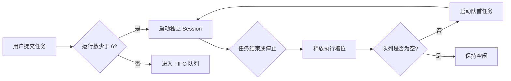

# AgentLinear

> 用看板管理多个本地 Codex 会话，让长任务可以并行运行、排队等待、随时续聊。


AgentLinear 面向同时处理多个长程任务的 Codex 用户。每张任务卡片对应一个独立会话；任务可以静默执行、自动排队，也可以在完成后带着原有上下文继续沟通。

仓库当前包含可直接打开的高保真 HTML Demo，以及已经接入 SQLite、本地文件夹和真实 Codex Session 的 Electron 桌面应用。

## 现在可以体验什么

- **Session 分组**：Electron 中从真实本地文件夹创建分组，并写入 SQLite；浏览器模式保留演示数据。
- **文件夹管理**：支持重新关联、真实磁盘重命名、重名校验和移除空分组。
- **多任务看板**：运行中、排队中、已完成和已取消任务可以出现在同一分组内。
- **6 个并发槽位**：Electron 使用 SQLite 持久队列，同时最多运行 6 个真实 Codex Session。
- **自动递补**：运行任务结束后，FIFO 队首立即获得空闲槽位；重复 drain 不会重复启动任务。
- **上下文续聊**：Electron 保存真实 Codex Session ID，通过官方 app-server `thread/resume` 恢复同一卡片的完整上下文。
- **客户端会话可见**：新任务使用 app-server 交互线程并写入任务标题，因此会出现在本地 Codex/ChatGPT 客户端记录中；旧版 `exec` Session 启动时会 fork 完整历史到可见线程。
- **本地附件**：第一轮和续聊都可选择多个真实文件；附件路径与消息一起留存在 SQLite，并由本机完整权限的 Codex 读取。
- **客户端权限对齐**：Codex 任务使用本机完整权限，可复用网络、macOS 钥匙串及 `lark-cli` 等已有登录环境。
- **静默执行反馈**：执行期间只显示状态，结束后一次性呈现结果。
- **深色模式**：默认跟随系统外观，也可从顶部手动切换并记住选择。
- **本地留存**：Electron 使用 SQLite 保存任务、Session、消息与运行记录；浏览器 Demo 使用 `localStorage`。
- **崩溃恢复**：启动时先核对数据库与本机进程，清理可信的遗留 Codex 进程、恢复未领取队列，并把可能已经改过文件的运行标记为“已中断”，等待用户检查后手动重试。
- **项目排期**：应用内置 AgentLinear 自身的需求排期；MVP 项目全部完成后显示明确的空状态，完成证据保留在代码、测试与文档中。

## 快速开始（macOS MVP）

当前 MVP 明确支持 macOS。开始前需要：

- Node.js 22.16 或更高版本（仓库提供 `.nvmrc`；该版本开始完整提供本项目使用的 SQLite 备份 API）。
- 已安装并登录的 [OpenAI Codex CLI](https://github.com/openai/codex)。
- 一个已经备份或纳入 Git 版本控制、允许 Codex 修改的本地项目目录。

安装 Codex CLI 后先完成登录：

```bash
npm install -g @openai/codex
codex login
```

然后安装并启动 AgentLinear：

```bash
git clone https://github.com/Ivor-NCUT/AgentLinear.git
cd AgentLinear
npm ci
npm run doctor
npm start
```

`doctor` 全程只读取本机环境，不上传代码、文件路径、登录信息或诊断结果。自检通过后，`npm start` 会打开 AgentLinear 桌面窗口；当前版本不需要 AgentLinear 云端账号。

右上角的环境状态会检查 Node.js、Codex CLI、本机登录状态和数据目录权限。若显示“环境需处理”，点击状态即可看到下一步操作。也可以通过 `AGENTLINEAR_CODEX_PATH` 指定非标准位置的 Codex 可执行文件。

例如使用 ChatGPT macOS 应用内置的 Codex：

```bash
AGENTLINEAR_CODEX_PATH="/Applications/ChatGPT.app/Contents/Resources/codex" npm start
```

### 直接打开

双击 `index.html`，或把文件拖进浏览器。

### 使用浏览器预览

```bash
git clone https://github.com/Ivor-NCUT/AgentLinear.git
cd AgentLinear
python3 -m http.server 4173
```

打开 [http://localhost:4173](http://localhost:4173)。

## 关键交互

| 场景 | Demo 中的行为 |
| --- | --- |
| 新建任务 | 点击任意分组底部的“在此分组添加任务”，选择记录待办或发送给 Codex |
| 并发已满 | 新任务自动进入全局 FIFO 队列 |
| 停止任务 | 当前任务转为已取消，队首任务自动启动 |
| 继续对话 | 打开卡片追加指令，原有消息与附件继续保留 |
| 添加文件 | 在新建任务或续聊输入区选择多个本地文件 |
| 修改分组 | 点击分组右上角三点菜单，名称与路径同步更新 |
| 查看排期 | 从侧边栏打开“需求排期”，确认本地后端 MVP 的开发顺序与验收标准 |

## 调度模型



队列是全局的，Session 分组只负责组织任务与关联工作目录。任务从一个状态切换到另一个状态时，所属分组不会改变。

## 当前边界

当前桌面闭环已经覆盖本地文件夹、真实 Codex Session、附件、持久队列、完整进程树停止与异常退出恢复。MVP 目前从源码运行，只承诺 macOS；尚未提供签名的 `.dmg` 安装包，也尚未承诺 Windows 与 Linux 支持。

## 常见问题

### `doctor` 提示 Node.js 版本过低

如果使用 nvm，在仓库目录运行：

```bash
nvm install
nvm use
```

随后重新运行 `npm ci && npm run doctor`。

### 找不到 Codex CLI

先确认 `codex --version` 可以在同一终端运行。如果 Codex 位于非标准路径，显式指定：

```bash
AGENTLINEAR_CODEX_PATH="/你的路径/codex" npm run doctor
AGENTLINEAR_CODEX_PATH="/你的路径/codex" npm start
```

显式路径无效时 AgentLinear 会直接报错，不会静默切换到另一个 Codex。

### Codex 尚未登录

在终端运行 `codex login`，确认 `codex login status` 成功后重新自检。

### 任务被标记为“已中断”

这表示应用上次没有正常退出，或运行状态不完整。AgentLinear 不会自动重放可能已经修改过文件的指令。请先检查 Git diff 和任务结果，再点击“重试任务”；若已经保存 Codex Session ID，会继续原会话上下文。

### 数据保存在哪里

任务、消息、附件路径、队列与运行记录保存在 Electron 的本地 `userData` 目录，不会写入项目仓库或上传。点击应用右上角的环境状态可查看数据目录检查结果。数据库会启用 WAL，并在迁移前创建本地备份。

### 如何提交问题

先运行 `npm run doctor` 和 `npm run check`。公开报告前请删除用户名、完整项目路径、指令内容、日志与数据库中的隐私信息；安全问题请参阅 [`SECURITY.md`](SECURITY.md)。

## 桌面架构

采用 **Electron + Node.js + SQLite**。它复用现有 Web 前端技术，GitHub 用户只需准备 Node.js 与 Codex CLI 即可本地运行；应用不依赖 AgentLinear 云端账号或 SaaS 服务。详细决策见 [`docs/ARCHITECTURE.md`](docs/ARCHITECTURE.md)。

```text
Desktop UI
  ├─ Session groups       本地文件夹与任务组织
  ├─ Scheduler            6 并发槽位与 FIFO 队列
  ├─ Codex adapter        创建、恢复、停止本地 Codex 进程
  ├─ Persistence          SQLite 会话、消息、附件与运行记录
  ├─ Startup recovery     孤儿进程、运行记录与队列租约对账
  └─ File system bridge   文件选择、目录关联与安全重命名
```

当前后端围绕三个真实问题构建：

1. 用稳定的 Session ID 恢复 Codex 多轮上下文。
2. 让调度器在应用重启后正确恢复运行、排队和中断状态。
3. 可靠终止子进程及其进程树，避免后台残留。

## 项目结构

```text
AgentLinear/
├── index.html                  高保真交互 Demo，包含样式、数据与前端逻辑
├── package.json                Electron 启动命令与 Node.js 版本约束
├── src/
│   ├── main.js                 Electron 主进程与安全窗口边界
│   ├── attachment-service.js   附件路径、元信息与失效检测
│   ├── codex-adapter.js        Codex app-server JSON-RPC 与 Session resume
│   ├── database.js             SQLite schema、迁移、备份与恢复
│   ├── environment.js          Codex、Node.js 与目录权限预检
│   ├── group-service.js        本地文件夹与 SQLite 分组服务
│   ├── recovery.js             启动状态对账、孤儿进程清理与队列恢复
│   ├── scheduler.js            SQLite 全局 6 并发 FIFO 调度器
│   ├── task-service.js         任务、消息、运行记录与后台执行
│   └── preload.cjs             渲染进程的最小权限桥
├── scripts/
│   └── doctor.mjs              不联网的本地安装与登录状态自检
├── docs/
│   ├── ARCHITECTURE.md         已确认的技术路线与进程边界
│   ├── FRONTEND_LOGIC.md       已冻结的前端产品逻辑
│   └── FRONTEND_ACCEPTANCE.md  完整人工验收脚本
├── tests/
│   ├── database.test.mjs       数据模型、持久化和恢复测试
│   ├── doctor.test.mjs         自检成功、隐私输出与错误指引测试
│   ├── attachment-service.test.mjs  附件校验、失效与安全移除测试
│   ├── codex-adapter.test.mjs  app-server、resume、旧 Session 迁移与停止测试
│   ├── environment.test.mjs    本地运行环境预检测试
│   ├── group-service.test.mjs  文件夹创建、重命名、回滚与删除测试
│   ├── recovery.test.mjs       崩溃状态对账、真实孤儿进程树与手动重试测试
│   ├── scheduler.test.mjs      6 并发、FIFO、递补与防重复测试
│   ├── task-service.test.mjs   首轮执行、续聊与失败持久化测试
│   └── verify-demo.mjs         可重复运行的前端静态验证
└── README.md                   产品说明、运行方式与后续架构
```

运行验证：

```bash
npm run check
```

测试脚本会在 Node.js 22 上显式启用内置 SQLite；Electron 桌面运行时已经包含该能力，不需要用户额外设置启动参数。

贡献方式见 [`CONTRIBUTING.md`](CONTRIBUTING.md)，安全边界见 [`SECURITY.md`](SECURITY.md)。代码以 [MIT License](LICENSE) 开源。

## 设计原则

- **本地优先**：代码、附件、会话和执行结果默认留在用户电脑上。
- **状态清楚**：运行、等待、完成和取消必须一眼可辨。
- **上下文连续**：卡片是 Session 的长期容器，续聊不会创建陌生的新任务。
- **资源有上限**：固定并发额度保护电脑资源，排队规则保持可预测。
- **进程可控**：停止、超时和退出会终止完整进程树，避免后台残留孤儿进程。

## 反馈

欢迎提交 Issue，说明你同时运行多个 Codex 任务时最容易卡住的环节。
