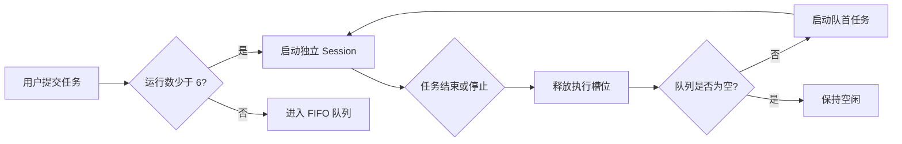

# AgentLinear

> 用看板管理多个本地 Codex 会话，让长任务可以并行运行、排队等待、随时续聊。


AgentLinear 面向同时处理多个长程任务的 Codex 用户。每张任务卡片对应一个独立会话；任务可以静默执行、自动排队，也可以在完成后带着原有上下文继续沟通。

仓库当前包含一份可直接打开的高保真 HTML Demo，用来确认产品模型、状态反馈和主要交互。真实 Codex 进程、SQLite 数据库与文件系统操作尚未接入。

## 现在可以体验什么

- **Session 分组**：每列对应一个本地项目文件夹，标题直接显示文件夹名称。
- **分组重命名**：修改分组名称时同步预览新的文件夹路径，并保存到本地。
- **多任务看板**：运行中、排队中、已完成和已取消任务可以出现在同一分组内。
- **6 个并发槽位**：同时最多运行 6 个 Agent，其余任务按创建顺序等待。
- **自动递补**：运行任务停止后，队首任务立即获得空闲槽位。
- **上下文续聊**：同一张卡片保留多轮消息，已完成任务也能继续追加指令。
- **本地附件**：第一轮指令和后续消息都可以选择多个本地文件。
- **静默执行反馈**：执行期间只显示状态，结束后一次性呈现结果。
- **本地留存**：Demo 状态保存在浏览器 `localStorage` 中。
- **项目排期**：应用内置 AgentLinear 自身的前端需求表，包含优先级、开发顺序和验收口径。

## 快速开始

这个版本没有构建步骤，也没有第三方依赖。

### 直接打开

双击 `index.html`，或把文件拖进浏览器。

### 使用本地服务器

```bash
git clone https://github.com/Ivor-NCUT/AgentLinear.git
cd AgentLinear
python3 -m http.server 4173
```

打开 [http://localhost:4173](http://localhost:4173)。

## 关键交互

| 场景 | Demo 中的行为 |
| --- | --- |
| 新建任务 | 点击任意分组底部的“在此分组添加任务” |
| 并发已满 | 新任务自动进入全局 FIFO 队列 |
| 停止任务 | 当前任务转为已取消，队首任务自动启动 |
| 继续对话 | 打开卡片追加指令，原有消息与附件继续保留 |
| 添加文件 | 在新建任务或续聊输入区选择多个本地文件 |
| 修改分组 | 点击分组右上角三点菜单，名称与路径同步更新 |
| 查看排期 | 从侧边栏打开“需求排期”，确认前端功能顺序与验收标准 |

## 调度模型



队列是全局的，Session 分组只负责组织任务与关联工作目录。任务从一个状态切换到另一个状态时，所属分组不会改变。

## 当前边界

这份 Demo 用于验证产品逻辑，以下操作仍是前端模拟：

- 没有启动真实 Codex CLI 进程。
- “停止任务”不会杀死系统进程。
- 分组改名只更新 Demo 数据，不会修改磁盘上的文件夹。
- 附件只记录文件元信息，没有交给 Codex 读取。
- 数据保存在 `localStorage`，没有 SQLite、崩溃恢复或跨窗口同步。

## 计划中的桌面架构

```text
Desktop UI
  ├─ Session groups       本地文件夹与任务组织
  ├─ Scheduler            6 并发槽位与 FIFO 队列
  ├─ Codex adapter        创建、恢复、停止本地 Codex 进程
  ├─ Persistence          SQLite 会话、消息、附件与运行记录
  └─ File system bridge   文件选择、目录关联与安全重命名
```

下一阶段会优先处理三个真实问题：

1. 用稳定的 Session ID 恢复 Codex 多轮上下文。
2. 让调度器在应用重启后正确恢复运行、排队和中断状态。
3. 可靠终止子进程及其进程树，避免后台残留。

## 项目结构

```text
AgentLinear/
├── index.html   高保真交互 Demo，包含样式、数据与前端逻辑
└── README.md    产品说明、运行方式与后续架构
```

## 设计原则

- **本地优先**：代码、附件、会话和执行结果默认留在用户电脑上。
- **状态清楚**：运行、等待、完成和取消必须一眼可辨。
- **上下文连续**：卡片是 Session 的长期容器，续聊不会创建陌生的新任务。
- **资源有上限**：固定并发额度保护电脑资源，排队规则保持可预测。

## 反馈

欢迎提交 Issue，说明你同时运行多个 Codex 任务时最容易卡住的环节。
